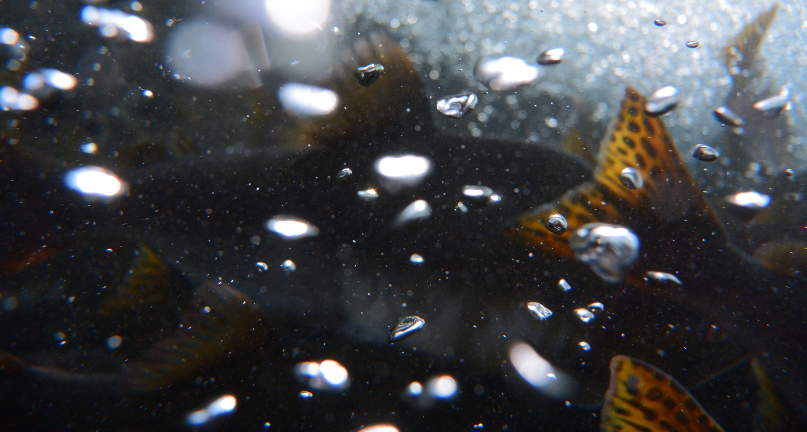

```{r, include = F}
knitr::opts_chunk$set(echo = F, message = F)
library(knitr)
library(icons)
```


<br />
<br />


# Profile

<span style="font-weight:bold; ">Taihei Yamada</span> <br />
<span style="font-weight:bold; ">山田 太平</span>

[`r icon_style(icons::fontawesome("researchgate"), scale = 1.8, fill = '#5A5A5A')`](https://www.researchgate.net/profile/Taihei-Yamada-2) [`r icon_style(icons::fontawesome("orcid"), scale = 1.8, fill = '#5A5A5A')`](https://orcid.org/0000-0002-6120-7094) [`r icon_style(icons::fontawesome("instagram"), scale = 1.8, fill = '#5A5A5A')`](https://www.instagram.com/prbnmt/) 

Faculty of Environmental Earth Science, Hokkaido University
<br />
JSPS Research Fellow PD

北海道大学大学院地球環境科学研究院 小泉研究室 博士研究員
<br />
日本学術振興会 特別研究員 PD

E-mail: thymd8 [at] gmail.com
<br />
<br />
<br />

## Research Interests

生物多様性保全、生物間相互作用、水圏生態学
<br />
Biodiversity conservation, Biological interactions, Aquatic ecology
<br />
<br />
<br />


<style>
table, th, td {
    font-size: 100%;
}
</style>

## Works
| | | |
| :-- | :-- | :-------- |
| 2023.10 – Present | PostDoc Position | Faculty of Environmental Earth Science, Hokkaido Univ., Japan<br />北海道大学 大学院地球環境科学研究院 |
| 2018.09 – 2020.08 | Assistant Curator | Higashitaisetsu Museum, Japan<br />上士幌町 商工観光課 ひがし大雪自然館 |
<br />


## Education
| | | |
| :-- | :-- | :-------- |
| 2020.04 – 2023.09 | Ph.D. | Grad. Agriculture, Hokkaido Univ., Japan<br />北海道大学 大学院農学院 |
| 2017.04 – 2019.03 | M.Agr. | Grad. Agriculture, Hokkaido Univ., Japan<br />北海道大学 大学院農学院 |
| 2013.04 – 2017.03 | B.F.Sc. | Sch. Marine Biosciences, Kitasato Univ., Japan<br />北里大学 海洋生命科学部 |
| 2010.04 – 2013.03 |    | Okinawa Prefectural Yaeyama HS, Japan<br />沖縄県立八重山高等学校 |
<br />


## Fellowships and Grants
| | | |
| :-- | :-- | :-------- |
| 2022.04 – 2024.03 | | JSPS Research Fellow DC2<br />日本学術振興会特別研究員DC2 |
| 2021.10 – 2022.03 | | Hokkaido University DX Doctoral Fellowship<br />北海道大学 DX 博士人材フェローシップ |
<br />


## Skills
| | |
| :- | :---------------- |
| `r icon_style(icons::fontawesome("registered"), scale = 1.8, fill = '#5A5A5A')` | Data handling and analysis using R |
| `r icon_style(icons::fontawesome("map"), scale = 1.8, fill = '#5A5A5A')` | GIS |
| `r icon_style(icons::fontawesome("fish"), scale = 1.8, fill = '#5A5A5A')` | Fish surveys<br />魚類に関する野外調査全般 |
| `r icon_style(icons::fontawesome("bug"), scale = 1.8, fill = '#5A5A5A')` | Identification of aquatic invertebrates<br />水生昆虫の同定 |
| `r icon_style(icons::fontawesome("motorcycle"), scale = 1.8, fill = '#5A5A5A')` | Driver's license for large motorcycles<br />大型自動二輪免許 |


<!-- Global site tag (gtag.js) - Google Analytics -->
<script async src="https://www.googletagmanager.com/gtag/js?id=G-BQZTKPH9SP"></script>
<script>
  window.dataLayer = window.dataLayer || [];
  function gtag(){dataLayer.push(arguments);}
  gtag('js', new Date());

  gtag('config', 'G-BQZTKPH9SP');
</script>


<!-- Google Fonts -->
<link rel="preconnect" href="https://fonts.googleapis.com"> 
<link rel="preconnect" href="https://fonts.gstatic.com" crossorigin> 
<link href="https://fonts.googleapis.com/css2?family=Josefin+Sans&display=swap" rel="stylesheet">
