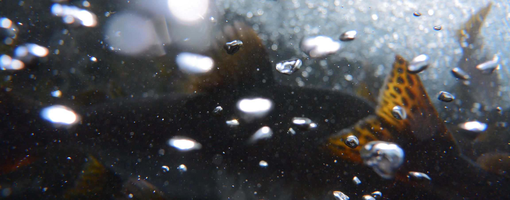

```{r, include = F}
knitr::opts_chunk$set(echo = F, message = F)
library(knitr)
library(icons)
```

<div style="position: relative; display: inline-block; text-align: center;">
  
  <h3 style="position: absolute; top: 45%; left: 50%; transform: translate(-50%, -50%);
             color: white; font-weight: bold; white-space: nowrap;">
    Taihei Yamada's Website
  </h3>
</div>

<br>
Latest update - 16 February, 2025 <br />
<br>

# About

<span style="font-size:20px; "> 山田 太平 / Taihei Yamada, Ph.D. </span><br />
E-mail: thymd8 [at] gmail.com<br />
[`r icon_style(icons::fontawesome("researchgate"), scale = 1.8, fill = '#5A5A5A')`](https://www.researchgate.net/profile/Taihei-Yamada-2) 
[`r icon_style(icons::fontawesome("orcid"), scale = 1.8, fill = '#5A5A5A')`](https://orcid.org/0000-0002-6120-7094) 
[`r icon_style(icons::fontawesome("twitter"), scale = 1.8, fill = '#5A5A5A')`](https://twitter.com/thyrbn) 
[`r icon_style(icons::fontawesome("bold"), scale = 1.8, fill = '#5A5A5A')`](https://bsky.app/profile/thymd.bsky.social) 
<br>
<br>

```{r, include = F}
knitr::opts_chunk$set(echo = F, message = F)
library(knitr)
```

::: {.float-image style="display: flex; align-items: flex-start; align-items: center;"}
```{r out.width = '100', out.extra = 'style="float:left; padding-right:10px"', echo = FALSE}
knitr::include_graphics("images/icon.png")
```

Assistant Professor, Freshwater Ecology Lab.<br />
National Fisheries University, Japan Fisheries Research and Education Agency<br />
国立研究開発法人水産研究・教育機構 水産大学校 生物生産学科<br />
淡水生態学研究室 助教<br />
:::

<br>

## Research Interests

生物多様性保全、生物間相互作用、水圏生態学
<br />
Biodiversity conservation, Biological interactions, Aquatic ecology
<br />
<br />


<style>
table, th, td {
    font-size: 100%;
}
</style>

## Works
| | | |
| :-- | :-- | :-------- |
| 2024.04 – Present | Assistant Professor | National Fisheries University, Japan Fisheries Research and Education Agency, Japan<br />国立研究開発法人水産研究・教育機構 水産大学校 生物生産学科 |
| 2023.10 – 2024.03 | PostDoc Position | Faculty of Environmental Earth Science, Hokkaido University, Japan<br />北海道大学 大学院地球環境科学研究院 |
| 2018.09 – 2020.08 | Assistant Curator | Higashitaisetsu Museum, Japan<br />上士幌町 商工観光課 ひがし大雪自然館 |


## Education
| | | |
| :-- | :-- | :-------- |
| 2020.04 – 2023.09 | Ph.D. | Grad. Agriculture, Hokkaido University, Japan<br />北海道大学 大学院農学院 |
| 2017.04 – 2019.03 | M.Agr. | Grad. Agriculture, Hokkaido University, Japan<br />北海道大学 大学院農学院 |
| 2013.04 – 2017.03 | B.F.Sc. | Sch. Marine Biosciences, Kitasato University, Japan<br />北里大学 海洋生命科学部 |
| 2010.04 – 2013.03 |    | Okinawa Prefectural Yaeyama HS, Japan<br />沖縄県立八重山高等学校 |


## Fellowships and Grants
| | | |
| :--| :--------- |
| 2024.07 – 2026.03 | JSPS KAKENHI (Grant-in-Aid for Research Activity Start-up)<br />日本学術振興会  科学研究費助成事業 研究活動スタート支援 |
| 2023.10 – 2024.03 | JSPS Research Fellow PD<br />日本学術振興会 特別研究員-PD |
| 2022.04 – 2023.09 | JSPS Research Fellow DC2<br />日本学術振興会 特別研究員-DC2 |
| 2021.10 – 2022.03 | Hokkaido University DX Doctoral Fellowship<br />北海道大学 DX 博士人材フェローシップ |


## Skills
| | |
| :- | :---------------- |
| `r icon_style(icons::fontawesome("registered"), scale = 1.8, fill = '#5A5A5A')` | Data handling and analysis using R |
| `r icon_style(icons::fontawesome("map"), scale = 1.8, fill = '#5A5A5A')` | GIS |
| `r icon_style(icons::fontawesome("fish"), scale = 1.8, fill = '#5A5A5A')` | Fish surveys<br /> |
| `r icon_style(icons::fontawesome("bug"), scale = 1.8, fill = '#5A5A5A')` | Identification of aquatic invertebrates |
| `r icon_style(icons::fontawesome("motorcycle"), scale = 1.8, fill = '#5A5A5A')` | Driver's license for large motorcycles |
<br>
<br>


# Outputs

## International Papers
\*Corresponding author, ^\†^Equal contribution

### – In Review/Preparation
| | |
| :- | :---------------- |
| in review | <span style="font-weight:bold; color: #06283D; ">Taihei Yamada</span>\*, Itsuro Koizumi, & Futoshi Nakamura.<br />Seasonal changes in the ratio of congeneric charrs in northern Japanese tributaries with different temperature regimes. <u>[Preprint](https://doi.org/10.21203/rs.3.rs-2465444/v1)</u> |
| in review | <span style="font-weight:bold; color: #06283D; ">Taihei Yamada</span>\* et al.<br />Temporal responses of the macroinvertebrate community structure to sediment replenishment downstream of a dam. |
| in prep. | <span style="font-weight:bold; color: #06283D; ">Taihei Yamada</span>\* et al.<br />Predicting riverbed particle size can uncover how salmonid spawning habitat is fragmented by artificial barriers. |

### – Published
| | |
| :- | :---------------- |
| 2024 | <span style="font-weight:bold; color: #06283D; ">Taihei Yamada</span>\*, Takahiro Nobetsu, Hirokazu Urabe, & Futoshi Nakamura.<br />Invasion status of hatchery-origin pink salmon in an unstocked river at the Shiretoko World Natural Heritage Site in northern Japan.<br />*Journal of Fish Biology* 104(5): 1633–1637. <u>[Link](https://doi.org/10.1111/jfb.15690)</u> |
| 2024 | <span style="font-weight:bold; color: #06283D; ">Taihei Yamada</span>\*, Hirokazu Urabe, & Futoshi Nakamura.<br />Pink salmon productivity is driven by catchment hydrogeomorphology and can decline under a changing climate.<br />*Freshwater Biology* 69(3): 376–386. <u>[Link](https://doi.org/10.1111/fwb.14217)</u> |
| 2023 | Honoka Nakahashi^\†^, <span style="font-weight:bold; color: #06283D; ">Taihei Yamada</span>\*^\†^, Nobuo Ishiyama, & Futoshi Nakamura.<br />Ecological value of gravel pit ponds for floodplain wetland fish.<br />*Freshwater Biology* 68(2): 340–348. <u>[Link](https://doi.org/10.1111/fwb.14029)</u> |
| 2022 | <span style="font-weight:bold; color: #06283D; ">Taihei Yamada</span>\*, Hirotaka Katahira, Kazuki Miura, & Futoshi Nakamura.<br />Relationship between salmon egg subsidy and the distribution of an avian predator. <br />*Ecology and Evolution* 12(12): e9696. <u>[Link](https://doi.org/10.1002/ece3.9696)</u> |
| 2022 | <span style="font-weight:bold; color: #06283D; ">Taihei Yamada</span>\*, Hirokazu Urabe, & Futoshi Nakamura. <br />Diel migration pattern of pink salmon fry in small streams. <br />*Journal of Fish Biology* 100(4): 1088–1092. <u>[Link](https://doi.org/10.1111/jfb.15007)</u> |
| 2020 | <span style="font-weight:bold; color: #06283D; ">Taihei Yamada</span>\*, Itsuro Koizumi, Hirokazu Urabe, & Futoshi Nakamura. <br />Temperature-dependent swimming performance differs by species: Implications for condition-specific competition between stream salmonids. <br />*Zoological Science* 37(5): 429–433. <u>[Link](https://doi.org/10.2108/zs190149)<u/> |


## Domestic Papers
| | |
| :- | :---------------- |
| 2021 | 三浦一輝, 崎山智樹, 宇久村三世, <span style="font-weight:bold; color: #06283D; ">山田太平</span>. <br />知床半島河川において採集したコガタカワシンジュガイ. <br />斜里町立知床博物館研究報告 43: 1–4. (non-refereed) |
| 2020 | <span style="font-weight:bold; color: #06283D; ">山田太平</span>, 三浦一輝. <br />北海道豊頃町および新得町におけるカワシンジュガイ属（*Margaritifera*）の採集記録. <br />ひがし大雪自然館研究報告 7: 41–45. (non-refereed) |
| 2019 | <span style="font-weight:bold; color: #06283D; ">山田太平</span>, 三浦一輝. <br />北海道十勝地方におけるカワシンジュガイ（*Margaritifera laevis*）とコガタカワシンジュガイ（*M. togakushiensis*）の生息情報. <br />ひがし大雪自然館研究報告 6: 9–12. (non-refereed) |


## Presentations
| | |
| :- | :---------------- |
| 2024/12 | <span style="font-weight:bold; color: #06283D; ">山田太平</span>. <br />知床半島におけるカラフトマスの再生産状況. <br />第45回魚類系統研究会, 北海道札幌市, 口頭. |
| 2024/12 | 吉野裕生, 植村洋亮, <span style="font-weight:bold; color: #06283D; ">山田太平</span>, 小泉逸郎. <br />底生無脊椎動物群集の湧水・非湧水河川比較. <br />第45回魚類系統研究会, 北海道札幌市, 口頭. |
| 2024/03 | <span style="font-weight:bold; color: #06283D; ">山田太平</span>, 卜部浩一, 中村太士. <br />カラフトマスの再生産効率に対する撹乱の影響は流域の地形によって左右されるか？ <br />日本生態学会第71回全国大会, 神奈川県横浜市, ポスター. |
| 2023/07 | Ryota Fujimura, Junko Morimoto, <span style="font-weight:bold; color: #06283D; ">Taihei Yamada</span>, Takashi Ono, Futoshi Nakamura. <br />Considering deer behavior at multiple scales for restoring broadleaved forest. <br />The 11th Annual International Association for Landscape Ecology (IALE) World Congress, Nairobi, Kenya, Oral. |
| 2023/03 | <span style="font-weight:bold; color: #06283D; ">山田太平</span>, 卜部浩一, 中村太士. <br />溯河性サケ科魚類の再生産効率と流域地形特性の関係. <br />令和5年度日本水産学会春季大会, 東京都港区, 口頭. |
| 2023/03 | <span style="font-weight:bold; color: #06283D; ">山田太平</span>, 片平浩孝, 三浦一輝, 中村太士. <br />サケの産卵は鳥類捕食者の分布を規定するか？ <br />日本生態学会第70回全国大会, オンライン, ポスター. |
| 2022/12 | <span style="font-weight:bold; color: #06283D; ">山田太平</span>, 卜部浩一, 中村太士. <br />流域の地形特性は溯河性サケ科魚類の再生産効率を規定するか？ <br />第15回サケ学研究会, 北海道札幌市, 口頭. |
| 2022/12 | <span style="font-weight:bold; color: #06283D; ">山田太平</span>, 卜部浩一, 中村太士. <br />溯河性サケ科魚類の再生産効率は流域の地形特性によって規定される. <br />第43回魚類系統研究会, 北海道札幌市, 口頭. |
| 2022/10 | <span style="font-weight:bold; color: #06283D; ">Taihei Yamada</span>, Hirokazu Urabe, Futoshi Nakamura. <br />A broad-scale prediction of reduction in spawning habitats for salmonids by dams. <br />IYS Synthesis Symposium, The Westin Bayshore, Vancouver, Canada, Poster. |
| 2022/03 | <span style="font-weight:bold; color: #06283D; ">山田太平</span>, 卜部浩一, 中村太士. <br />ダムによるサケ科魚類の産卵環境減少の広域的予測. <br />日本生態学会第69回全国大会, オンライン, ポスター. |
| 2021/12 | 早津栄里, 岩崎巧実, 片平浩孝, <span style="font-weight:bold; color: #06283D; ">山田太平</span>, 宇久村三世, 三浦一輝. <br />サケと共に暮らす: 知床ペレケ川におけるカワガラスの卵食い. <br />第42回魚類系統研究会, 北海道札幌市, 口頭. |
| 2020/03 | <span style="font-weight:bold; color: #06283D; ">山田太平</span>, 小泉逸郎, 中村太士. <br />河川性サケ科魚類の水温依存的な種間競争: 季節変化を考慮した野外検証. <br />日本生態学会第67回全国大会, 愛知県名古屋市, ポスター. |
| 2018/03 | <span style="font-weight:bold; color: #06283D; ">山田太平</span>, 小泉逸郎, 卜部浩一, 中村太士. <br />河川性魚類の分布規定要因: 遊泳能力と種間競争を考慮した検証. <br />日本生態学会第65回全国大会, 北海道札幌市, ポスター. |


## Outreaches
| | |
| :-- | :---------------- |
| 2020/07/04 | 自然観察会: 淡水魚編 (市民向け観察会, 講師). ひがし大雪自然館, 上士幌. |
| 2020/06/30<br />2020/07/02 | 上士幌学: 水生昆虫と水質調査 (高校生向け講義, 講師). 北海道上士幌高等学校, 上士幌. |
| 2019/12/15 | 魚類学: 種同定とスケッチの基礎 (市民向け講座, 講師). ひがし大雪自然館, 上士幌. |
| 2019/07/14 | 自然観察会: 淡水魚編 (市民向け観察会, 講師). ひがし大雪自然館, 上士幌. |


<!-- Global site tag (gtag.js) - Google Analytics -->
<script async src="https://www.googletagmanager.com/gtag/js?id=G-BQZTKPH9SP"></script>
<script>
  window.dataLayer = window.dataLayer || [];
  function gtag(){dataLayer.push(arguments);}
  gtag('js', new Date());

  gtag('config', 'G-BQZTKPH9SP');
</script>


<!-- Google Fonts -->
<link rel="preconnect" href="https://fonts.googleapis.com"> 
<link rel="preconnect" href="https://fonts.gstatic.com" crossorigin> 
<link href="https://fonts.googleapis.com/css2?family=Josefin+Sans&display=swap" rel="stylesheet">
